title: アプリにプッシュ通知を<br>組み込もう！
class: animation-fade
layout: true

<!-- This slide will serve as the base layout for all your slides -->
<!-- .bottom-bar[
  {{title}}
] -->

---

class: impact

# {{title}}

.right[]

.footnote[
.left[
.size_small_7[
Copyright 2020 FUJITSU CLOUD TECHNOLOGIES LIMITED<br>
Created by natsumo ikeda (2020/10/27)
]
]
]

---

layout: true
class: center, middle, animation-fade

---

# はじめに

---
layout: false

.bottom-bar[
  はじめに
]

## プッシュ通知はなぜアプリに必要なのか？

.center[

]

---

.bottom-bar[
  はじめに プッシュ通知はなぜアプリに必要なのか？
]

### アプリの存在は忘れてしまうもの…

１人が１ヶ月に１回以上起動するアプリの数はおよそ .color_pink[ .size_large_18[__27個__]]<br>
１人が１ヶ月に10回以上起動するアプリの数わずか .color_pink[.size_large_18[__9個__]]

.col-8[
と言われています。<br>
アクティブに使われるアプリになるのはとても大変です…<br>
そこで、プッシュ通知が活躍してくる訳ですが、<br>その使い方には工夫も必要です。
]
.col-4[

]

---
.bottom-bar[
  はじめに プッシュ通知はなぜアプリに必要なのか？
]

### 1. アプリの変化を伝える役割
アプリのオートアップデートが当たり前になった今、新機能追加やバージョンアップがされても、そのままでは気づく手段がありません。<br>
.color_pink[__新しい機能を紹介やバージョンアップのお知らせ__]を伝えるためにプッシュ通知は有効と言えます。

.center[
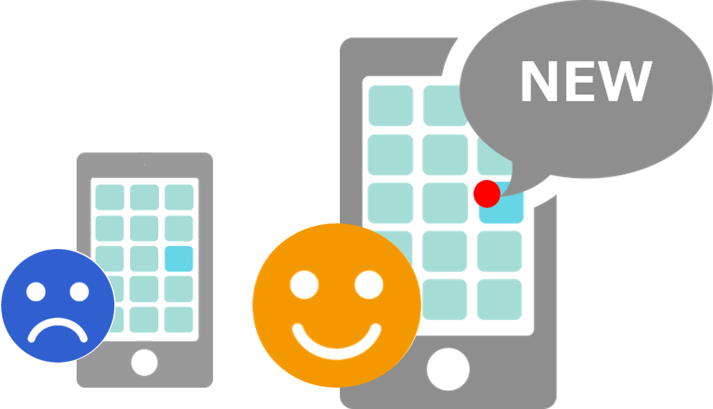
]


---
.bottom-bar[
  はじめに プッシュ通知はなぜアプリに必要なのか？
]

### 2. リマインダーとしての役割
しつこく送り続けると受信しない設定にされる可能性があるプッシュ通知ですが、ユーザがあえて通知を受けたいと思うアプリがあります。<br>
.color_pink[__メッセージ系アプリ・リマインダー系アプリ__]がその例です。

.col-6[
特定の時間や特定の場所に行ったときなど、ユーザーに応じてプッシュ通知を出し分けています。この通知の仕方であれば<br>
.color_pink[__ユーザにストレスを与えることなく__]アプリの存在を思い出してもらうことができます。
]
.col-6[
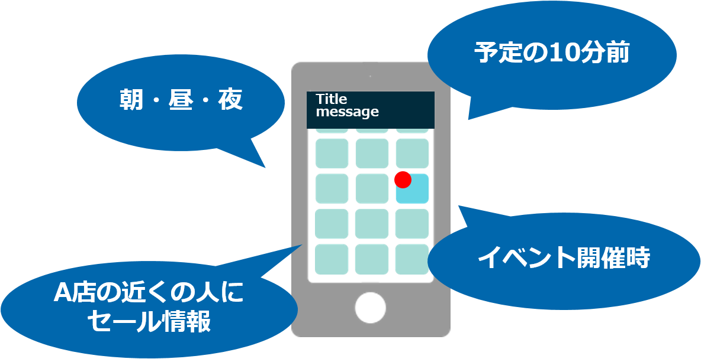
]

---
.bottom-bar[
  はじめに プッシュ通知はなぜアプリに必要なのか？
]

### 3. アプリを立ち上げずに内容を把握させる役割
今や当たり前となりましたが、送られて来たメッセージはプッシュ通知としてロック画面にも表示されるようになっています。<br>
アプリを起動せずとも「本文」を読むことができるので、返信をするかどうか、<br>
つまり.color_pink[__アプリを開くかどうかをプッシュ通知の内容で選択ができます__]。<br>

.center[

]

---
.bottom-bar[
  はじめに プッシュ通知はなぜアプリに必要なのか？
]

### まとめると…
* 上手にプッシュ通知を活用することでアプリを活性化させることが可能です！

.center[
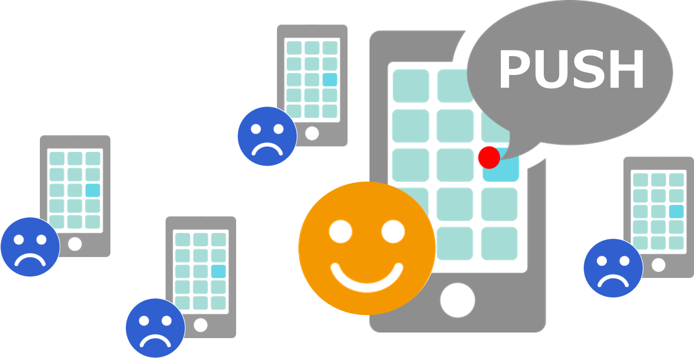
]

<br>
それでは、<br>アプリの活性化に欠かせないプッシュ通知の導入方法について学んでいきましょう！

---
.bottom-bar[
  はじめに ツール紹介
]

## Monacaって何？
* __もなか 【[Monaca](https://ja.monaca.io/)】__

.size_small_9[.col-5[
HTML5/JavaScript/CSS3でスマホアプリが開発できる開発環境。開発スタイル／コーディング環境は選択可能。
]]

.col-7[.center[]]

---
.bottom-bar[
  はじめに ツール紹介
]

## ニフクラ mobile backend って何？
* __にふくら-もばいる-ばっくえんど 【[ニフクラ mobile backend](https://mbaas.nifcloud.com/)】__

.size_small_9[.col-7[
スマートフォンアプリに必要なバックエンド機能が開発不要で利用できるクラウドサービス。 クラウド上に用意された機能をAPIで呼び出すだけで利用できます。また、APIを簡単に使うためのSDKを用意しています（ Swift / Objective-C / Android / JavaScript / Unity ）。mobile Backend as a Service の頭文字を取って、通称 **mBaaS** と呼ばれています。
]]

.col-5[.center[]]

---
.bottom-bar[
  はじめに ツール紹介
]

### Monacaとmobile backendでサーバー連携アプリは簡単に実現可能に
この２つを組み合わせると、高度なアプリも簡単スピーディーに開発できます。

.center[]

.col-6[
__《アプリ側》Monaca の利点__
.size_small_7[
* **無料** から使える！
* iOS / Android 同時に開発可能！
* いつでもどこでも、ブラウザで開発OK！
* **SDK導入** はクリックだけで簡単！
]
]
.col-6[
__《サーバー側》mobile backend の利点__
.size_small_7[
* **無料** から使える！
* **バックエンドの開発・運用は一切不要**！
* **コントロールパネル** からクラウドの状況をパッと確認できる！
]
]

---
.bottom-bar[
  はじめに
]

## 今回体験する内容

動作確認端末（ iOS / Android ）により内容が異なります。

.col-6[
### 講義
#### プッシュ通知の仕組み
* プッシュ通知が配信されて、端末に届くまでの流れを紹介します
]
.col-6[
### ハンズオン
#### プッシュ通知の導入方法
* 実際に Monaca でアプリを作成し、mobile backend でプッシュ通知を導入する手順を紹介します
]

---

layout: true
class: center, middle, animation-fade

---

# 準備

---

layout: false

.bottom-bar[
準備 事前準備
]

## 事前準備
### 共通
下記登録を完了し、アカウントを作成してください。

* Monacaの利用登録（無料）
  * [Monaca（一般）](https://monaca.mobi/ja/signup) または [Monaca Education](https://monaca.education/ja/signup)
* [ニフクラ mobile backend](https://mbaas.nifcloud.com/signup.htm) の利用登録（無料）

.right_top[

]


---
layout: false

.bottom-bar[
準備 事前準備
]

### iOS で動作確認をするの場合
* Mac （OSは最新版推奨）
  * 「キーチェーンアクセス」「Xcode」を利用します
  * Chrome 最新版
* 動作確認用 iPhone または iPad（iOS 9 以降）
* [Apple Developer Program アカウントの取得](https://developer.apple.com/programs/jp/)（__有料：99米ドル/年__）

.right_top[

]

---
layout: false

.bottom-bar[
準備 事前準備
]

### Android で動作確認をするの場合
* PC
 * Chrome 最新版
* 動作確認用 Android（OS 4以降）
* [Google アカウントの取得](https://accounts.google.com/SignUp)（__無料__）

.right_top[

]


---
layout: true
class: center, middle, inverse_sub
---
# 講義

---
layout: false

.bottom-bar[
講義 目次
]

## 目次

.size_large_13[
1. プッシュ通知配信の仕組み
1. プッシュ通知配信に必要な準備と設定
  * iOS で動作確認をする場合
  * Android で動作確認をする場合
]

---
layout: false

.bottom-bar[
講義 1. プッシュ通知配信の仕組み
]

## 1. プッシュ通知配信の仕組み

.size_small_7[
* プッシュ通知の配信は必ず APNs / FCM という iOS / Android のプッシュ通知配信サーバーを介して行っています
* アプリの起動時にプッシュ通知受信のための準備として図の ①～③の処理が行われます
  * ① アプリ側から APNs / FCM へプッシュ通知の許可を行うと、② APNs / FCM から デバイストークン / レジスタレーションID という端末とアプリを識別するためのIDが発行されます
  * 取得した デバイストークン / レジスタレーションID はプッシュ通知の配信時に使用する為 ③ アプリ側から mobile  に保存されます
]

.center[
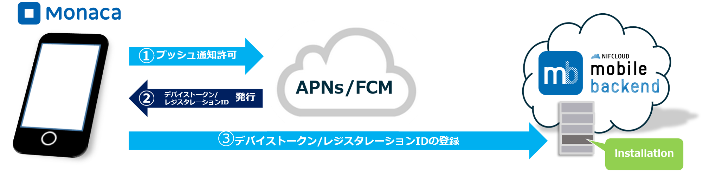
]

.right_top[

]
---
.bottom-bar[
講義 1. プッシュ通知配信の仕組み
]

.size_small_7[
* プッシュ通知配信時には ④～⑥ の処理が行われ、アプリへプッシュ通知が配信されます
   * ④ mobile  でプッシュ通知の配信登録がされると ⑤ mobile  から APNs / FCM にプッシュ通知の配信依頼がされます
      * このとき デバイストークン / レジスタレーションID が使われます
   * ⑥ APNs / FCM から順次アプリ側へプッシュ通知が配信されます
]

.center[
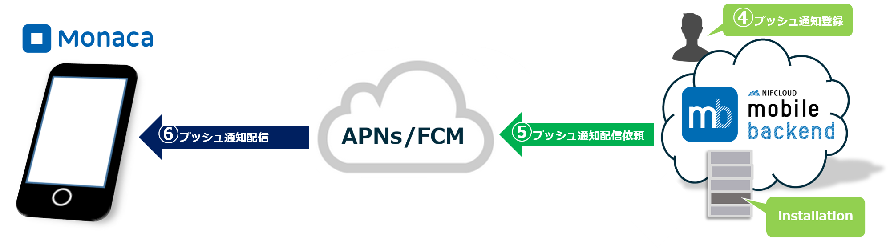
]

.size_small_7[
ただし、 APNs / FCM を利用するためには、 証明書 / サーバーキー などを用意し、アプリ側または mobile backend 側に設定する必要があります
]

.right_top[

]

---

.bottom-bar[
講義 2. プッシュ通知配信に必要な準備と設定
]

## 2. プッシュ通知配信に必要な準備と設定
### iOS で動作確認をする場合

.center[

]

.right_top[

]

---

.bottom-bar[
講義 2. プッシュ通知配信に必要な準備と設定
]

.size_small_9[
* iOS の場合は作成に必要なアカウントが有償だったり、作成するファイルに参照関係が<br>あるため、参照元から順に作成していく必要があったりと少々面倒です
* また操作を１つでも誤るとプッシュ通知が正しく送られないので注意が必要です
]

.center[

]

.right_top[

]

---

 <!--★要修正 -->

.bottom-bar[
講義 2. プッシュ通知配信に必要な準備と設定
]

### Android で動作確認をする場合

.size_small_9[
* Android の場合は Google アカウントがあれば特に難しい操作不要で、簡単に準備ができます
]

.center[
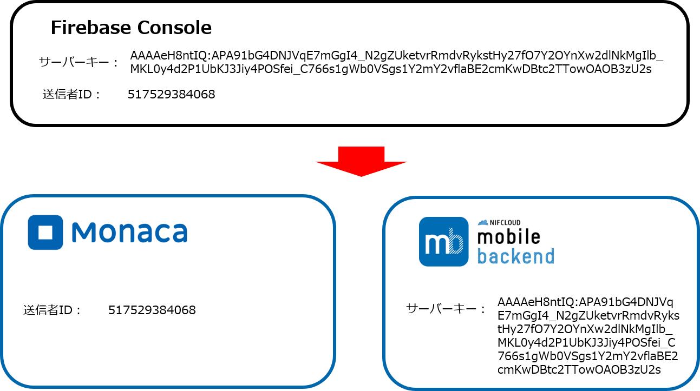
]

.right_top[

]

---
layout: true
class: center, middle, inverse_sub
---
# ハンズオン


---
layout: false

.bottom-bar[
ハンズオン 作業手順
]

## 作業手順

.size_small_9[
.col-6[
* 1.プッシュ通知受信に必要な準備
  * iOSで動作確認する場合
  * Androidで動作確認する場合
* 2.mobile backend の準備
  * アプリ新規作成
  * プッシュ通知設定
* 3.Monacaの準備
  * プロジェクト新規作成
  * プッシュ通知プラグインの有効化
  * 実装と mobile backend APIキーの設定
     * Androidで動作確認する場合のみ
]
.col-6[
* 4.ビルド
  * iOSで動作確認する場合
  * Androidで動作確認する場合
* 5.動作確認と実装コード解説
  * iOSで動作確認する場合
  * Androidで動作確認する場合
]
]

---

.bottom-bar[
ハンズオン 1.プッシュ通知受信に必要な準備
]

## 1.プッシュ通知受信に必要な準備
### iOSで動作確認する場合

.col-6[.size_small_9[
次の 1.～8. の手順で必要なファイルを作っていきます。
]
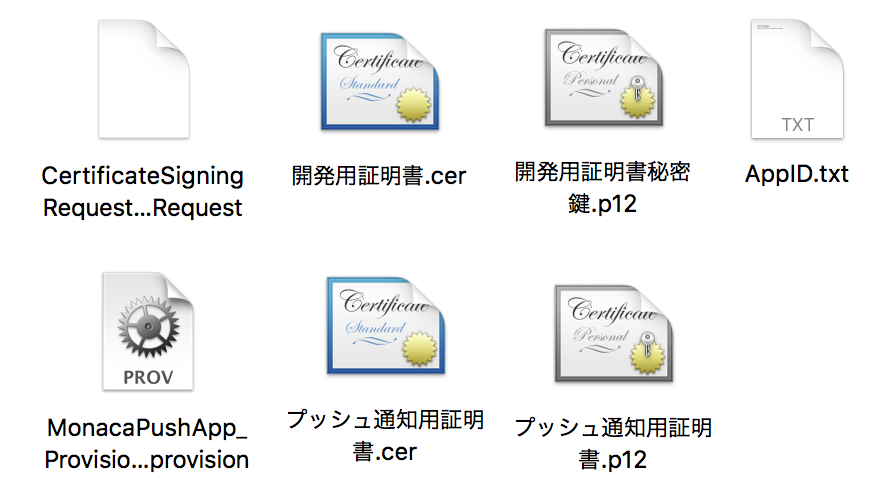
]
.col-6[
.size_small_9[
1. __CSRファイル__ の作成 .size_small_5[.color_pink[※初回のみ]]
1. __開発用証明書.cer__ の作成 .size_small_5[.color_pink[※初回のみ]]
1. __開発用証明書秘密鍵.p12__ の作成
1. __App ID__ の作成（Bundle ID）
1. __端末登録__ .size_small_5[.color_pink[※初回のみ]]
1. __プロビジョニングプロファイル__ の作成
1. __プッシュ通知用証明書.cer__ の作成
1. __プッシュ通知用証明書.p12__ の作成
]
]

.right_top[

]

---

.bottom-bar[
ハンズオン 1.プッシュ通知受信に必要な準備
]

#### 1. CSRファイル の作成 .size_small_7[.color_pink[※初回のみ]]

.size_small_7[
* キーチェーンアクセスを開きます
* 「キーチェーンアクセス」＞「証明書アシスタント」＞「認証局に証明書を要求」をクリックします
* 「ユーザーのメールアドレス」を入力します<br>（「通称」はそのまま、「CAのメールアドレス」は空欄でOK）
* 「要求の処理」は「ディスクに保存」を選択し「鍵ペア情報を設定」にチェックを入れます
* 「続ける」をクリックします
]

.center[
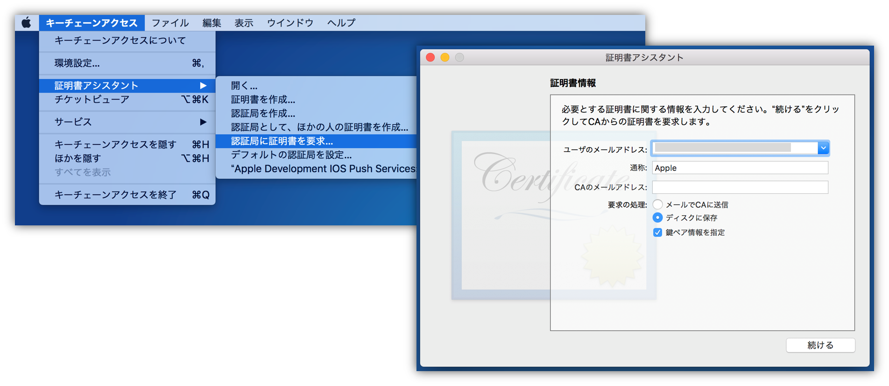
]

.right_top[

]

---

.bottom-bar[
ハンズオン 1.プッシュ通知受信に必要な準備
]

#### 1. CSRファイル の作成 .size_small_7[.color_pink[※初回のみ]]

.size_small_7[
* 保存先の選択が出るので任意の場所を選択し「保存」をクリックします
* 「鍵ペア情報」画面を確認して「続ける」をクリックします
* 「設定結果」画面が出るので「完了」をクリックします
]

.center[
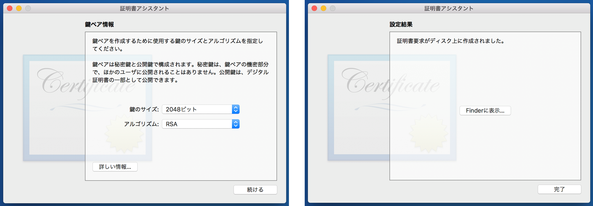
]

.size_small_7[
* CSRファイルの作成は完了です
]

.right_top[

]

---

.bottom-bar[
ハンズオン 1.プッシュ通知受信に必要な準備
]

#### 2.開発用証明書.cer の作成 .size_small_7[.color_pink[※初回のみ]]

.size_small_7[
* [Apple Developer Program](https://developer.apple.com/account/) にログインします
   * `https://developer.apple.com/account/`
* 「Certificates, Identifiers & Profiles」をクリックします
]

.center[
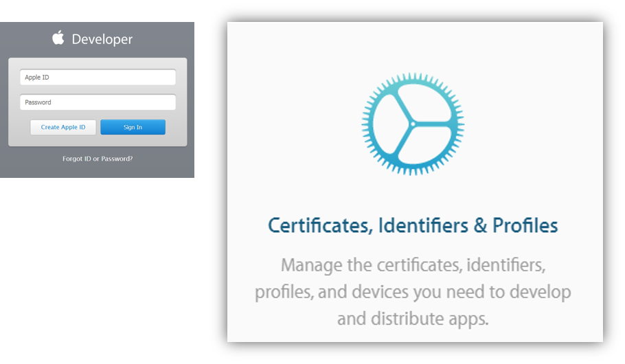
]

.right_top[

]

---

.bottom-bar[
ハンズオン 1.プッシュ通知受信に必要な準備
]

#### 2.開発用証明書.cer の作成 .size_small_7[.color_pink[※初回のみ]]

.size_small_7[
* 「Certificates」＞「All」をクリックし、右上の「 + 」をクリックします
* 「Add iOS Certificate」画面が表示されるので設定していきます
* 「iOS App Development」にチェックをいれ、下の方の「Continue」をクリックします
* 次の画面も「Continue」をクリックして進みます
]

.center[

]

.right_top[

]

---

.bottom-bar[
ハンズオン 1.プッシュ通知受信に必要な準備
]

#### 2.開発用証明書.cer の作成 .size_small_7[.color_pink[※初回のみ]]

.size_small_7[
* 1.で作成した「CSRファイルの作成」を選択し、「Continue」をクリックします
]

.center[

]

.right_top[

]

---

.bottom-bar[
ハンズオン 1.プッシュ通知受信に必要な準備
]

#### 2.開発用証明書.cer の作成 .size_small_7[.color_pink[※初回のみ]]

.size_small_7[
* 開発者用証明書.cer が作成されるので、「Download」をクリックして任意の場所に書き出します
* ダウンロードが終わったら「Done」をクリックします
]

.center[
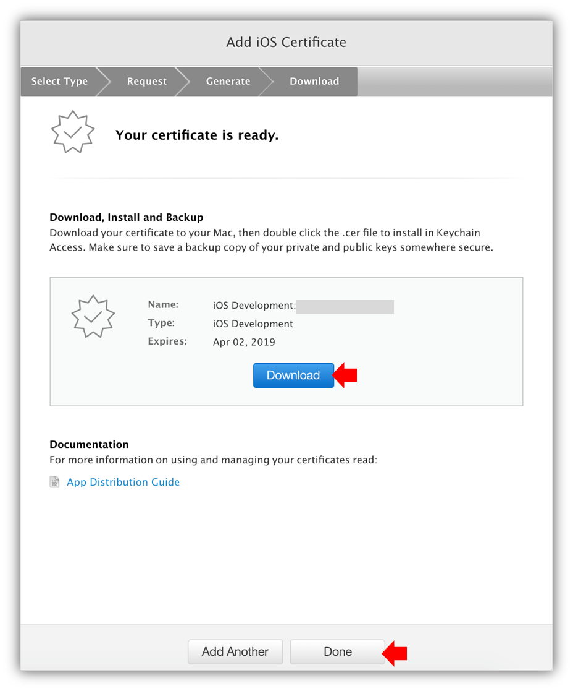
]

.size_small_7[
* 開発用証明書.cer の作成は完了です
]

.right_top[

]


---

.bottom-bar[
ハンズオン 1.プッシュ通知受信に必要な準備
]

#### 3.開発用証明書秘密鍵.p12 の作成

.size_small_7[
* Monacaでアプリをビルドする際は開発用証明書の秘密鍵が必要です
* 2.で作成した開発用証明書.cer をダブルクリックしてキーチェーンアクセスを開きます
]

.center[
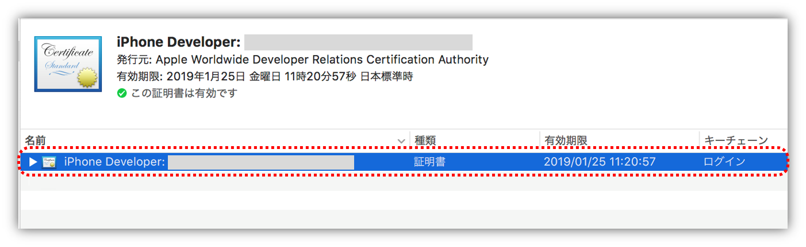
]

.size_small_7[
* 証明書左側に三角マークがあり、クリックすると中に秘密鍵が確認できます
* 確認したら閉じて図のようにしておきましょう
]

.right_top[

]

---

.bottom-bar[
ハンズオン 1.プッシュ通知受信に必要な準備
]

#### 3.開発用証明書秘密鍵.p12 の作成

.size_small_7[
* 閉じた状態で右クリックして「"iPhone Developer: ～"を書き出す…」をクリックします
]

.center[

]

.right_top[

]

---

.bottom-bar[
ハンズオン 1.プッシュ通知受信に必要な準備
]

#### 3.開発用証明書秘密鍵.p12 の作成

.size_small_7[
* ファイル名「名前」と保存先「場所」を指定して「保存」をクリックします
* パスワードを求められますが、 __何も入力しない__ で「OK」をクリックします
]

.center[

]

.size_small_5[.right[
※この後、システム側にパスワードを求められる場合があります。対応してください。
]]

.size_small_7[
* 開発用証明書秘密鍵.p12 が書き出されます
* 開発用証明書秘密鍵.p12 作成は完了です
]

.right_top[

]

---

.bottom-bar[
ハンズオン 1.プッシュ通知受信に必要な準備
]

#### 4.App ID の作成（Bundle ID）

.size_small_5[
※ 2. をスキップした方は、[Apple Developer Program](https://developer.apple.com/account/) を開き、「Certificates, Identifiers & Profiles」をクリックします
]

.size_small_7[
* 「Identifiers」の「AppIDs」をクリックして、右上の「＋」をクリックします
* 上から順に設定していきます
* まず「App ID Description」の「Name」にアプリの概要を記入します
* 次に「App ID Suffix」では「Explicit App ID」を選択し、「Bundle ID」を入力します
  * 「Wildcard App ID」ではプッシュ通知が利用できないので注意！
  * 「Bundle ID」はアプリ側で同じものを設定しますので必ず控えておきましょう
]

.center[
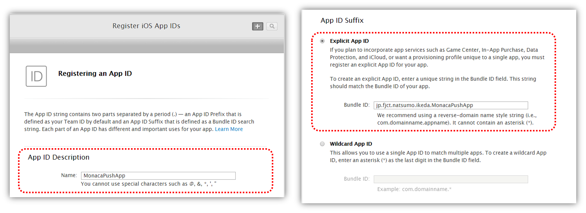
]

.right_top[

]

---

.bottom-bar[
ハンズオン 1.プッシュ通知受信に必要な準備
]

#### 4.App ID の作成（Bundle ID）

.col-7[.size_small_7[
* 最後に「App Services」では「Push Notifications」にチェックを入れます
  * これを忘れるとプッシュ通知が利用できないので注意！
* 「Continue」をクリックします
]]

.col-5[.center[
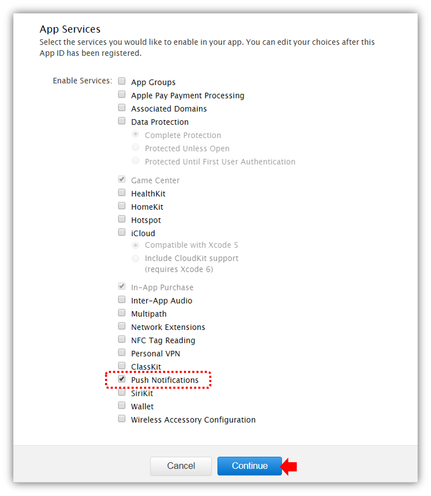
]]

.right_top[

]

---

.bottom-bar[
ハンズオン 1.プッシュ通知受信に必要な準備
]

#### 4.App ID の作成（Bundle ID）

.size_small_7[
* 「Push Notifications」が__Configurable__になっていることを確認しましょう
* 「Register」をクリックし次の画面で「Done」をクリックします
]

.center[

]

.size_small_7[
* これで App ID 作成は完了です
]

.right_top[

]

---

.bottom-bar[
ハンズオン 1.プッシュ通知受信に必要な準備
]

#### 5.端末登録 .size_small_7[.color_pink[※初回のみ]]

.size_small_7[
* 「Devices」＞「All」をクリックして、右上の「＋」をクリックします
* 「Register Device」を選択し、端末の「Name」と「UUID」を入力します
]

.center[

]

.right_top[

]

---

.bottom-bar[
ハンズオン 1.プッシュ通知受信に必要な準備
]

#### 5.端末登録 .size_small_7[.color_pink[※初回のみ]]

.col-5[.size_small_7[
* 端末のUUIDはXcodeを使うと確認し易いです
  * Mac に端末を接続し、Xcodeを起動します
  * 「Window」＞「Devices and Simulators」をクリックします
  * 「identifier」としてUUIDが確認できます
* 記入できたら「Continue」をクリックします
* 次の画面で端末情報を確認して「Register」をクリックします
* 更に次の画面で「Done」をクリックすると端末登録は完了です
]]

.col-7[.center[
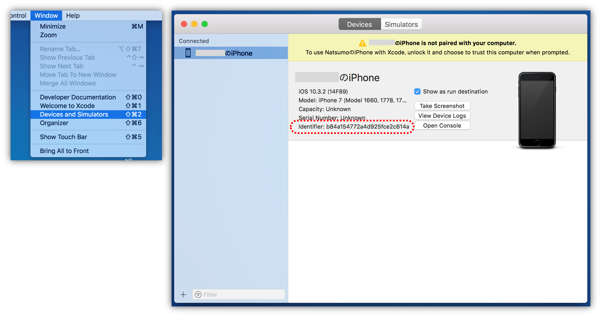
]]

.right_top[

]

---

.bottom-bar[
ハンズオン 1.プッシュ通知受信に必要な準備
]

#### 6.プロビジョニングプロファイル の作成

.col-7[.size_small_7[
* 「Provisioning Profiles」＞「All」をクリックして、右上の「＋」をクリックします
* 利用する App ID、開発用証明書、端末をそれぞれ紐付けていきます
* 「Development」の「iOS App Development」を選択し「Continue」をクリックします
]]

.col-5[.center[

]]

.right_top[

]

---

.bottom-bar[
ハンズオン 1.プッシュ通知受信に必要な準備
]

#### 6.プロビジョニングプロファイル の作成

.size_small_7[
* 4.で作成した App ID を選択し、「Continue」をクリックします
* 2.で作成した（あるいは既存の） 開発用証明書 を選択し「Continue」をクリックします
]

.center[

]

.right_top[

]

---

.bottom-bar[
ハンズオン 1.プッシュ通知受信に必要な準備
]

#### 6.プロビジョニングプロファイル の作成

.size_small_7[
* 5.で登録した（あるいは既存の）端末を選択し、「Continue」をクリックします
* 最後に「Profile Name」にファイル名入力します
* 紐付けを確認し「Continue」をクリックします
]

.center[
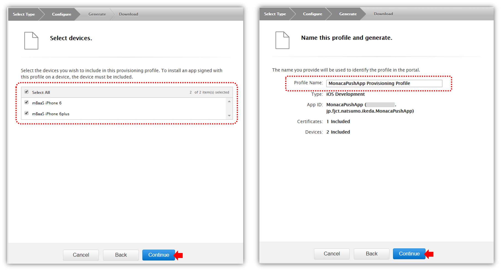
]

.right_top[

]

---

.bottom-bar[
ハンズオン 1.プッシュ通知受信に必要な準備
]

#### 6.プロビジョニングプロファイル の作成

.size_small_7[
* プロビショニングプロファイルがが作成されるので、「Download」をクリックして書き出します
* ダウンロードが終わったら「Done」をクリックします
]

.center[

]

.size_small_7[
* プロビショニングプロファイルの作成は完了です
]

.right_top[

]

---

.bottom-bar[
ハンズオン 1.プッシュ通知受信に必要な準備
]

#### 7.プッシュ通知用証明書.cer の作成

.col-7[.size_small_7[
* 「Certificates」＞「All」をクリックして、右上の「＋」をクリックします
* 2.で開発用証明書を作成したときとは異なり、「Development」の「Apple Push Notification service SSL (Sandbox)」を選択し、 「Continue」をクリックします
]]

.col-5[.center[
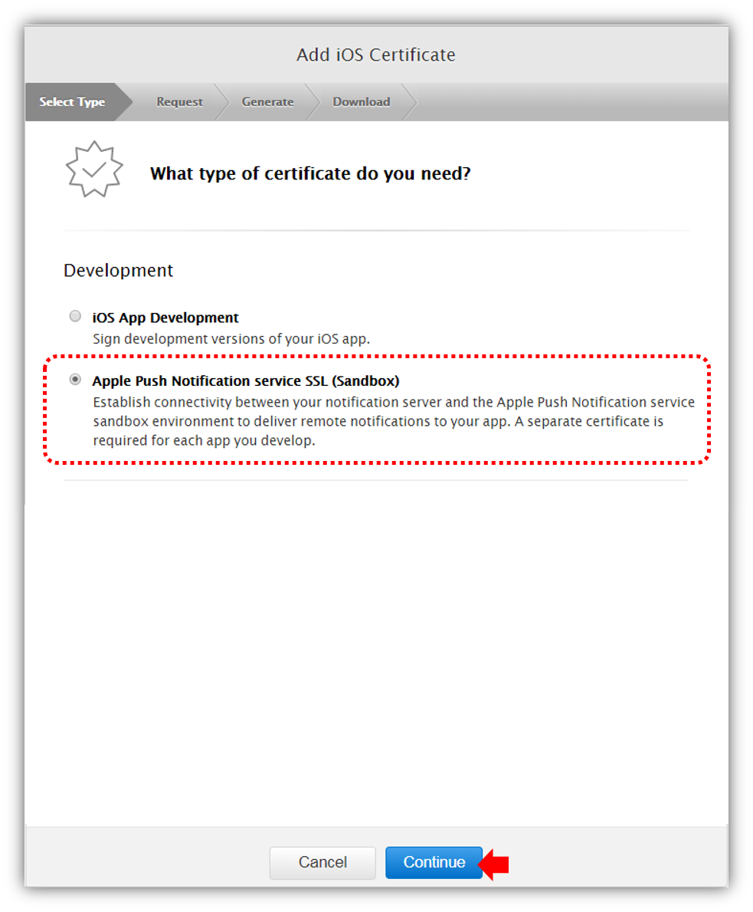
]]

.right_top[

]

---

.bottom-bar[
ハンズオン 1.プッシュ通知受信に必要な準備
]

#### 7.プッシュ通知用証明書.cer の作成

.size_small_7[
* 4.で作成した App ID を選択し、「Continue」をクリックします
* 次の画面は「Continue」をクリックして進みます
]

.center[
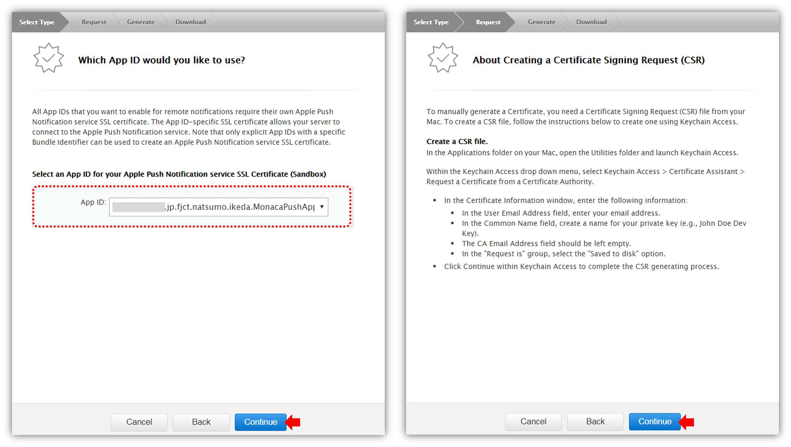
]

.right_top[

]

---

.bottom-bar[
ハンズオン 1.プッシュ通知受信に必要な準備
]

#### 7.プッシュ通知用証明書.cer の作成

.size_small_7[
* 1.で作成した（あるいは既存の）CSRファイルを選択し「Continue」をクリックします
* プッシュ通知用証明書.cer が作成されるので「Download」をクリックして書き出します
* ダウンロードが終わったら「Done」をクリックします
]

.center[
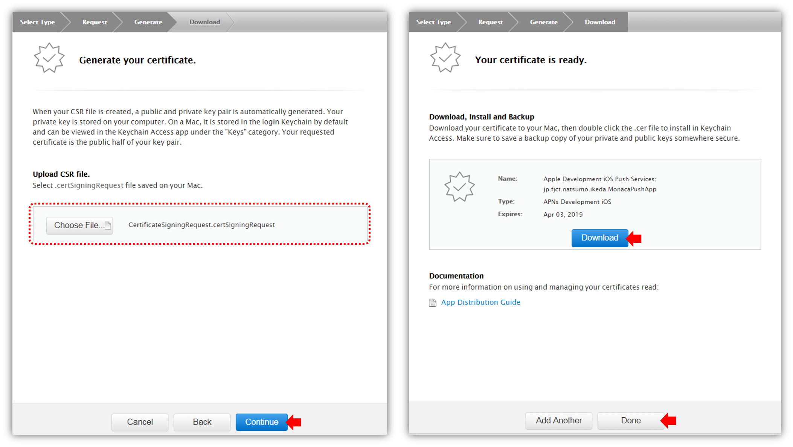
]

.size_small_7[
* プッシュ通知用証明書.cer の作成は完了です
]

.right_top[

]

---

.bottom-bar[
ハンズオン 1.プッシュ通知受信に必要な準備
]

#### 8. プッシュ通知用証明書.p12 の作成

.size_small_7[
* 7.で作成した プッシュ通知用証明書.cer をダブルクリックしてキーチェーンアクセスを開きます
* プッシュ通知用証明書.cer の左にある三角マークをクリックして開きます
  * プッシュ通知用証明書.cer ファイルには鍵がセットされています
]

.center[
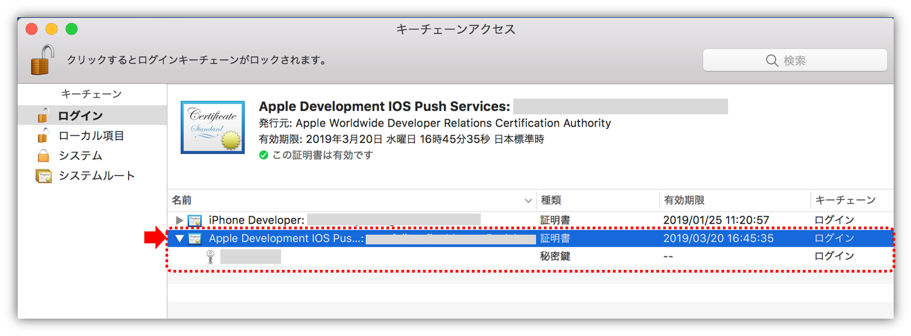
]

.right_top[

]

---

.bottom-bar[
ハンズオン 1.プッシュ通知受信に必要な準備
]

#### 8. プッシュ通知用証明書.p12 の作成

.size_small_7[
* プッシュ通知用証明書.p12 を書き出すには、開いた状態で.color_pink[__鍵ではなく証明書の上で右クリック__]をして「～を書き出す…」をクリックします
]

.center[
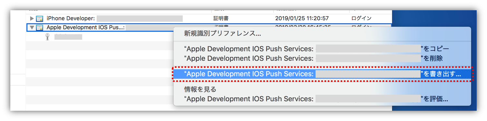
]

.right_top[

]

---

.bottom-bar[
ハンズオン 1.プッシュ通知受信に必要な準備
]

#### 8. プッシュ通知用証明書.p12 の作成

.size_small_7[
* ファイル名「名前」と保存先「場所」を指定して「保存」をクリックします
* パスワードを求められますが、 __何も入力しない__ で「OK」をクリックします
]

.center[
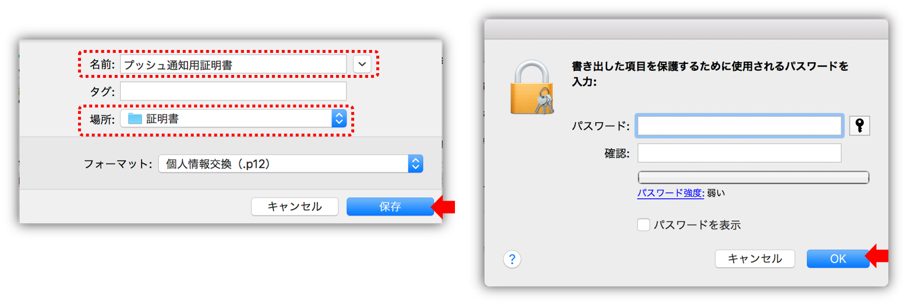
]

.right[.size_small_5[
※この後、システム側にパスワードを求められる場合があります。対応してください。
]]
.size_small_7[
* プッシュ通知用証明書.p12 が書き出されます
* プッシュ通知用証明書.p12 作成は完了です
]

.right_top[

]

---

.bottom-bar[
ハンズオン 1.プッシュ通知受信に必要な準備
]

### 確認

.size_small_9[
* 下記のファイルが作成されていればOKです
* １つのフォルダに保存しておきましょう
  * App ID はテキストファイルに控えておきましょう
]

.center[

]

.right_top[

]

---

.bottom-bar[
ハンズオン 1.プッシュ通知受信に必要な準備
]

### Androidで動作確認する場合

.size_small_7[
* [Firebase Console](https://console.firebase.google.com/)にアクセスします `https://console.firebase.google.com/`
  * プッシュ通知の配信に必要な __google-services.json__ ファイルと __秘密鍵（jsonファイル）__ を取得します
* プロジェクトを新規作成します
  * 「プロジェクトの追加」をクリックします
]
.center[

]

.right_top[

]

---

.bottom-bar[
ハンズオン 1.プッシュ通知受信に必要な準備
]

### Androidで動作確認する場合

.size_small_7[
* プロジェクト作成画面が開くので、プロジェクト名を入力し、「続行」をクリックします
]
.center[
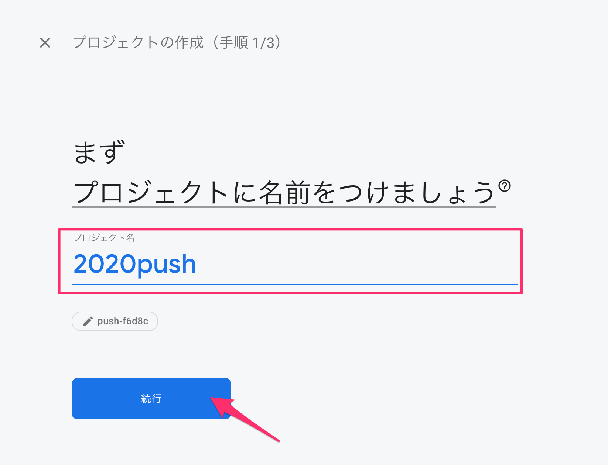
]


.right_top[

]

---

.bottom-bar[
ハンズオン 1.プッシュ通知受信に必要な準備
]

### Androidで動作確認する場合

.col-6[.size_small_7[
* 今回は「Google アナリティクス」は無効にしておきましょう
* 「プロジェクトを作成」をクリックします
]]
.col-6[.center[
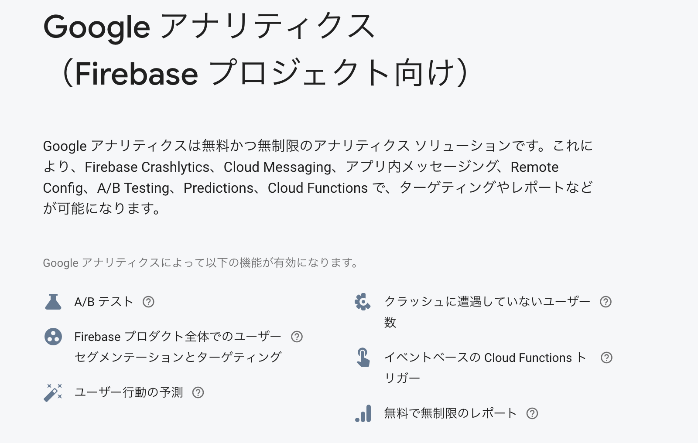
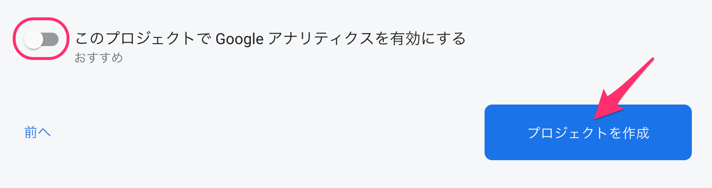
]]


.right_top[

]

---

.bottom-bar[
ハンズオン 1.プッシュ通知受信に必要な準備
]

### Androidで動作確認する場合

.size_small_7[
* しばらく待つと以下の画面が表示されるので「続行」をクリックします
]
.center[
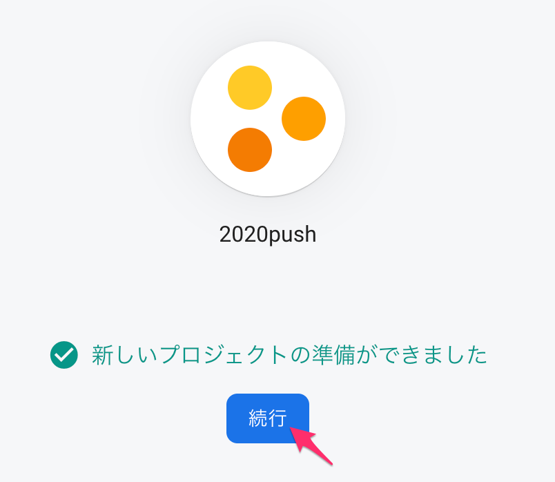
]

.right_top[

]

---

.bottom-bar[
ハンズオン 1.プッシュ通知受信に必要な準備
]

### Androidで動作確認する場合

.col-6[.size_small_7[
* 作成したプロジェクトが開かれます
* まず「google-services.json」を作成します
* 画面をスクロールして「Cloud Messaging」をクリックします

<br>
<br>
<br>
<br>

* 「Cloud Messaging」画面が表示されたら「Androidのマーク」をクリックします
]]
.col-6[.center[
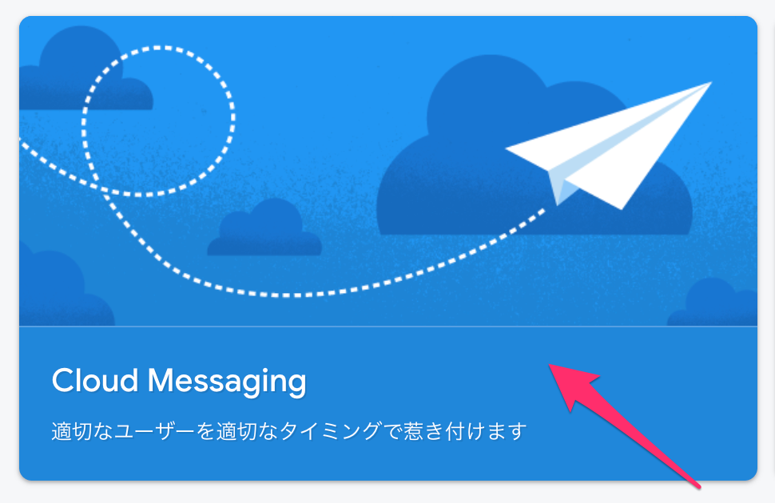<br>
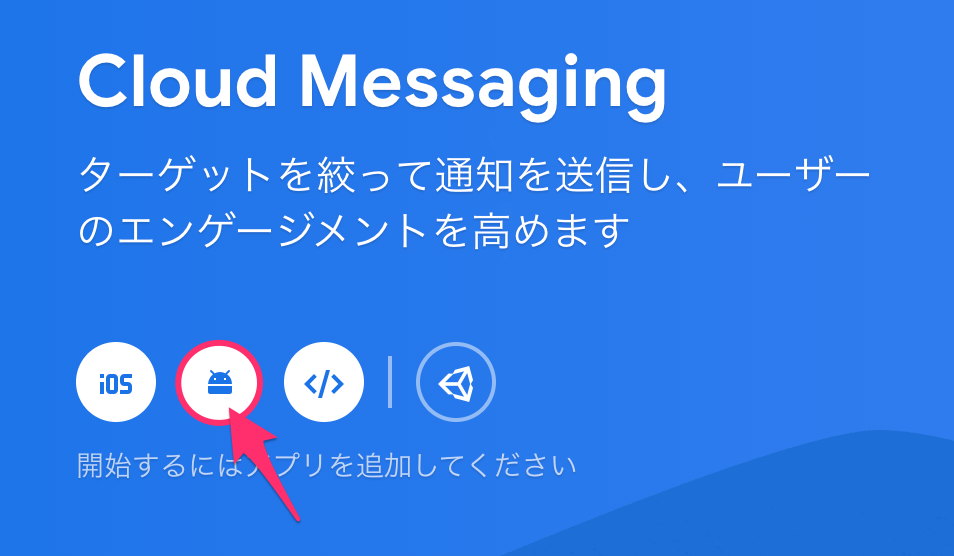
]]

.right_top[

]

---

.bottom-bar[
ハンズオン 1.プッシュ通知受信に必要な準備
]

### Androidで動作確認する場合

.size_small_7[
* 「パッケージ名」を入力して、「アプリを登録」をクリックします
  * ここで設定したパッケージ名はテキストファイルにに控えておきましょう（パッケージ名.txt）
]
.center[
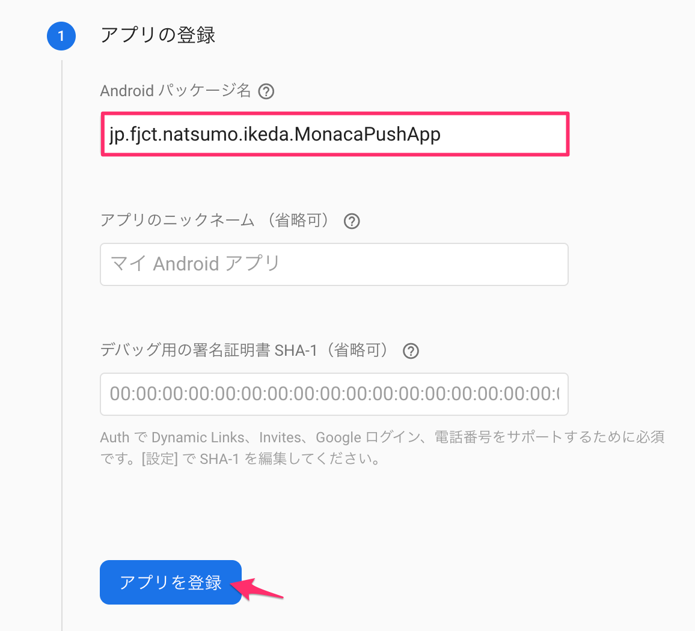
]

.right_top[

]

---

.bottom-bar[
ハンズオン 1.プッシュ通知受信に必要な準備
]

### Androidで動作確認する場合

.col-5[.size_small_7[
* 「google-services.json をダウンロード」をクリックします
* 「google-services.json」ファイルがダウンロードされます
  * 任意フォルダに保管しておきましょう
* この画面では「google-services.json」ファイルのダウンロード以外の作業は不要ですので、ダウンロードが終わったら「次へ」をクリックします
]]
.col-7[.center[
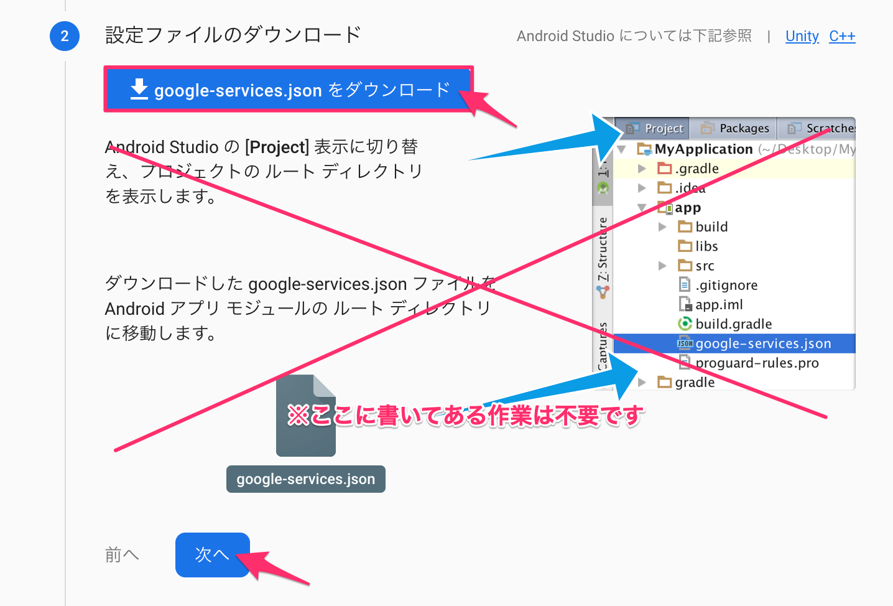
]]

.right_top[

]

---

.bottom-bar[
ハンズオン 1.プッシュ通知受信に必要な準備
]

### Androidで動作確認する場合

.col-5[.size_small_7[
* 「③Firebase SDK の追加」での作業は不要なので、そのまま「次へ」をクリックします
* 「④Android向けスタートガイドを読む」も作業は不要なので、そのまま「コンソールへ進む」をクリックします
]]
.col-7[.center[
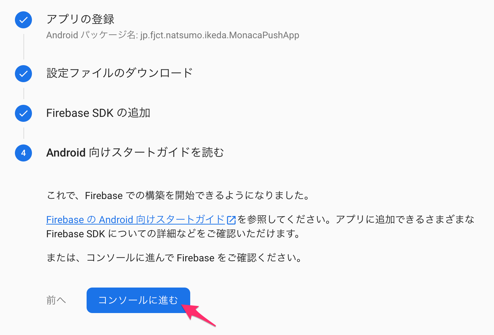
]]
.right_top[

]

---

.bottom-bar[
ハンズオン 1.プッシュ通知受信に必要な準備
]

### Androidで動作確認する場合

.size_small_7[
* 次に「秘密鍵（jsonファイル）」を取得します
* コンソール画面が表示されるので、左上の設定（歯車マーク）をクリックし、「プロジェクトの設定」をクリックします
]
.center[
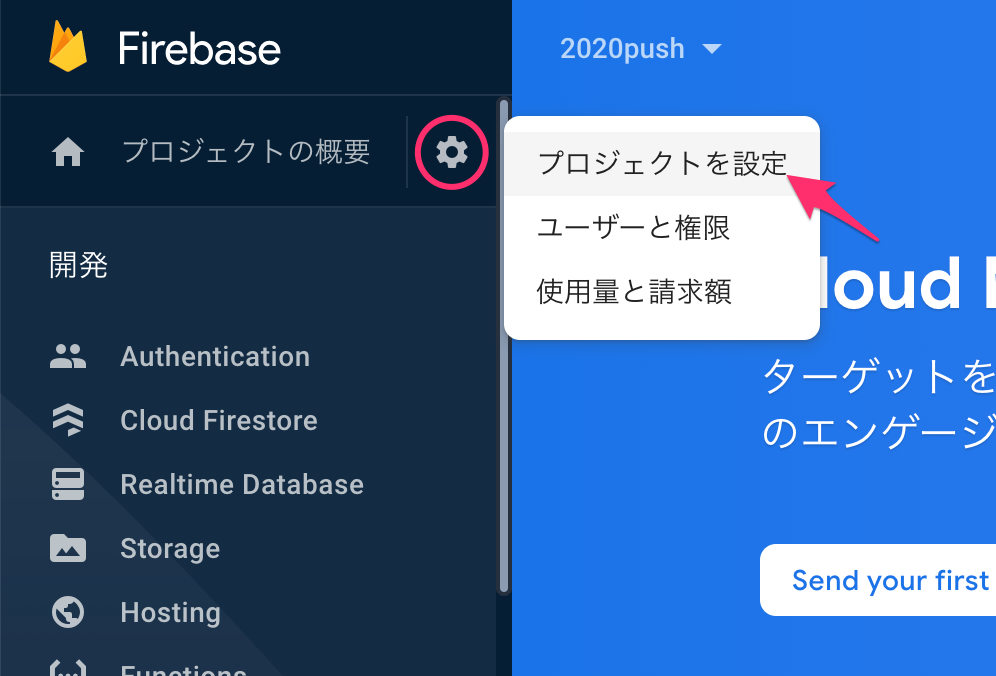
]

.right_top[

]

---

.bottom-bar[
ハンズオン 1.プッシュ通知受信に必要な準備
]

### Androidで動作確認する場合

.col-4[.size_small_7[
* 「Settings」画面が開かれます
* 上部タブの「サービスアカウント」をクリックします
* 下の方にある「新しい秘密鍵の生成」をクリックします
]]
.col-8[.center[
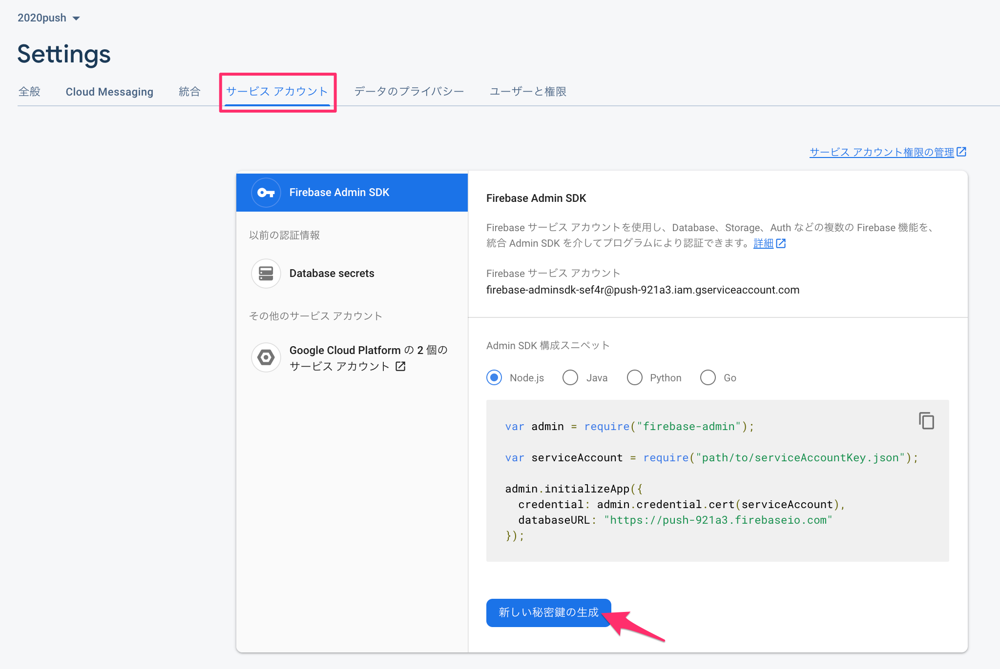
]]

.right_top[

]

---

.bottom-bar[
ハンズオン 1.プッシュ通知受信に必要な準備
]

### Androidで動作確認する場合

.col-7[.size_small_7[
* アラートが表示されるので、確認後「キーを生成」をクリックします
* 秘密鍵（jsonファイル）がダウンロードされます
  * 任意フォルダに保管しておきましょう

<br>
<br>
<br>
<br>
<br>
<br>

* 右記のファイルが作成されていればOKです
* １つのフォルダに保存しておきましょう
]]
.col-5[.center[
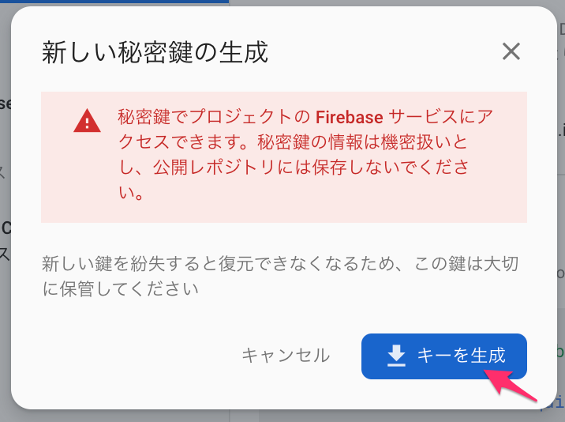<br><br>
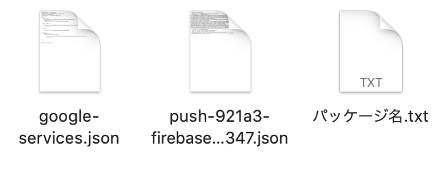
]]

.right_top[

]

---
.bottom-bar[
ハンズオン 2.mobile backend の準備
]

## 2.mobile backend の準備

.size_small_9[
* mobile backend にログインします `https://mbaas.nifcloud.com/`
]
.center[]

.right_top[

]

---
.bottom-bar[
ハンズオン 2.mobile backend の準備
]

### アプリ新規作成

.size_small_9[
* 新しいアプリを作成します
* アプリ名を入力し、「新規作成」をクリックします 例）.color_blue[__PushDemo__]
]
.center[]

.col-8[.size_small_7[
* mobile backend を既に使用したことがある場合は、画面上方のメニューバーにある「+新しいアプリ」をクリックすると同じ画面が表示されます
]]
.col-4[.center[
<br>

]]

.right_top[

]

---
.bottom-bar[
ハンズオン 2.mobile backend の準備
]

### アプリ新規作成

.size_small_9[
* アプリが作成されるとAPIキー（２種類）が発行されます
 * APIキーは後で使用します
* ここでは使用しないので、「OK」で閉じます
]
.center[]

.right_top[

]

---
.bottom-bar[
ハンズオン 2.mobile backend の準備
]

### アプリ新規作成

.size_small_9[
* 管理画面が表示されます
]
.center[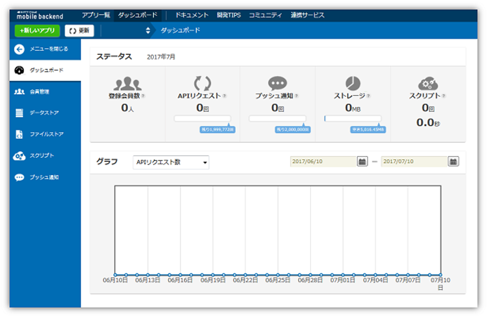]

.right_top[

]

---
.bottom-bar[
ハンズオン 2.mobile backend の準備
]

### プッシュ通知設定

.size_small_9[
* プッシュ通知の設定をします
* 右上の「アプリ設定」をクリックして、「プッシュ通知」をクリックします
]
.center[]

.right_top[

]

---
.bottom-bar[
ハンズオン 2.mobile backend の準備
]

### プッシュ通知設定
#### iOSで動作確認する場合

.col-5[.size_small_9[
* 「プッシュ通知の許可」で「許可する」にチェックを入れて「保存する」をクリックします
* 「証明書（p12）」の「証明書の選択」をクリックして、先ほど作成した「プッシュ通知用証明書.p12」を選択し「アップロード」をクリックします
]]
.col-7[.center[]]


.right_top[

]

---
.bottom-bar[
ハンズオン 2.mobile backend の準備
]

### プッシュ通知設定
#### iOSで動作確認する場合

.col-5[.size_small_9[
* 「証明書（p12）」が正しく設定されると以下のように表示されます
]]
.col-7[.center[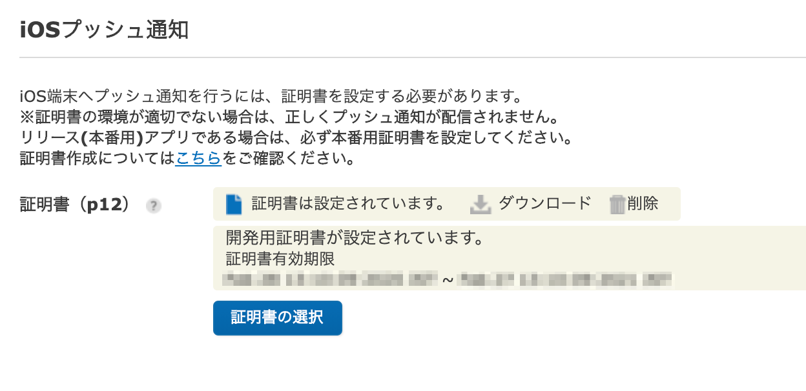]]


.right_top[

]

---

.bottom-bar[
ハンズオン 2.mobile backend の準備
]

### プッシュ通知設定
#### Androidで動作確認する場合

.col-5[.size_small_9[
* 「プッシュ通知の許可」で「許可する」にチェックを入れて「保存する」をクリックします
* 「プッシュ通知設定ふぁいる（json）」の「プッシュ通知設定ファイルの選択」をクリックして、先ほど作成した「秘密鍵（json）」を選択し「アップロード」をクリックします
]]
.col-7[.center[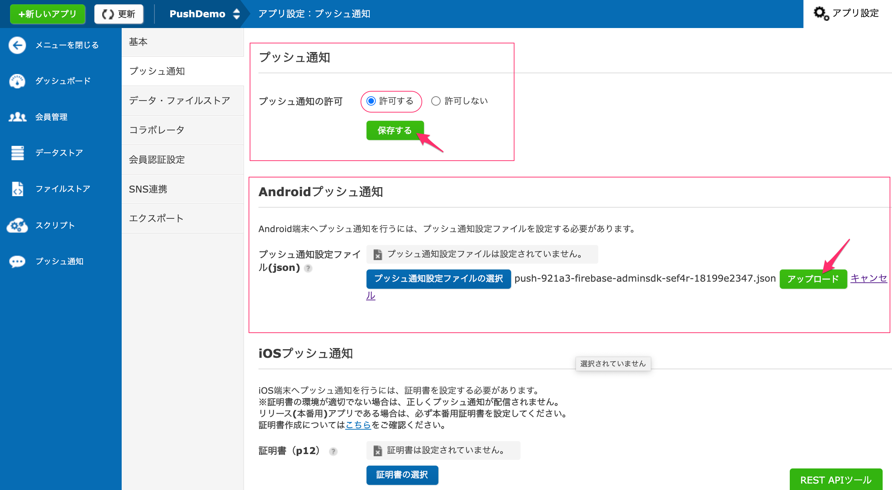]]


.right_top[

]

---

.bottom-bar[
ハンズオン 2.mobile backend の準備
]

### プッシュ通知設定
#### Androidで動作確認する場合

.col-5[.size_small_9[
* 「秘密鍵（json）」が正しく設定されると以下のように表示されます
]]
.col-7[.center[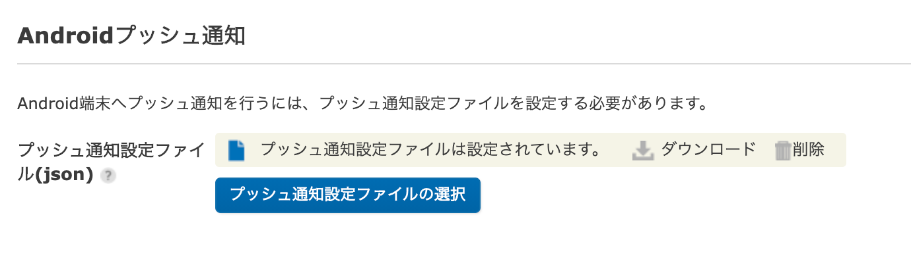]]


.right_top[

]

---
.bottom-bar[
ハンズオン 3.Monacaの準備
]

## 3. Monacaの準備

.size_small_9[
* Monacaにログインをします
]

.center[]

.size_small_9[
`https://ja.monaca.io/` または `https://edu.monaca.io/`
]
.right_top[

]

---
.bottom-bar[
ハンズオン 3.Monacaの準備
]

### プロジェクト新規作成

.col-5[.size_small_9[
* 新規でプロジェクトを作ります
* 「新規プロジェクトの作成」をクリックします
* テンプレート選択画面で「No Framework」をクリックすると「最小限のテンプレート」が表示されますので、「作成」をクリックします
]]
.col-7[.center[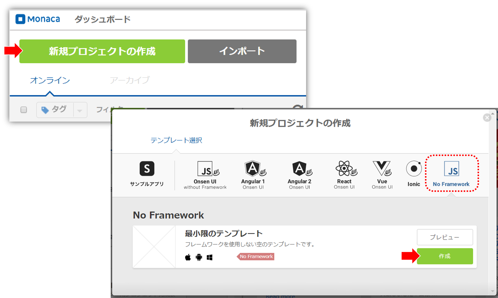]]

.right_top[

]

---
.bottom-bar[
ハンズオン 3.Monacaの準備
]

### プロジェクト新規作成

.col-5[.size_small_9[
* 「プロジェクト名」を入力し、「プロジェクトを作成する」をクリックします
]]
.col-7[.center[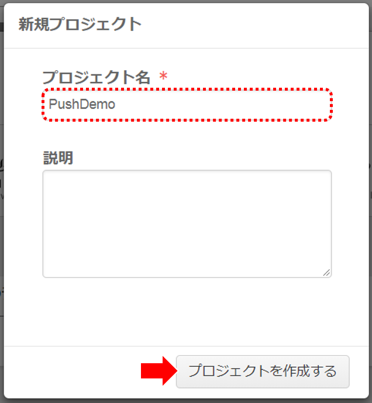]]

.right_top[

]

---

<!-- ★要修正 -->

.bottom-bar[
ハンズオン 3.Monacaの準備
]

### プロジェクト新規作成

.size_small_9[
* プロジェクトが開かれます
]
.center[]


.size_small_7[
* 今回はプレビュー画面は使用しないので、「プレビュー」タブをクリックして閉じておきましょう
]

.right_top[

]


---
.bottom-bar[
ハンズオン 3.Monacaの準備
]

### プッシュ通知プラグインの有効化

.size_small_9[
* mobile backend のプッシュ通知を利用するためのプラグインを導入します
* 「設定」タブをクリックして、「Cordovaプラグインの管理...」をクリックします
]
.center[]

.right_top[

]

---
.bottom-bar[
ハンズオン 3.Monacaの準備
]

### プッシュ通知プラグインの有効化

.col-6[.size_small_9[
* プラグインの一覧から「NIFCloudMB」を探します
.center[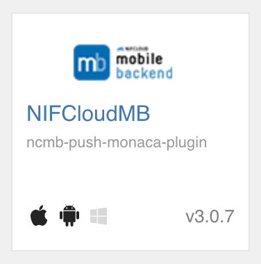]
* プラグインにカーソルを合わせると吹き出しが表示されます
* 吹き出し内の「有効」をクリックします
]]
.col-6[.center[

]]


.right_top[

]

---
.bottom-bar[
ハンズオン 3.Monacaの準備
]

### プッシュ通知プラグインの有効化

.size_small_9[
* 有効なプラグインとして表示されればOKです
]

.center[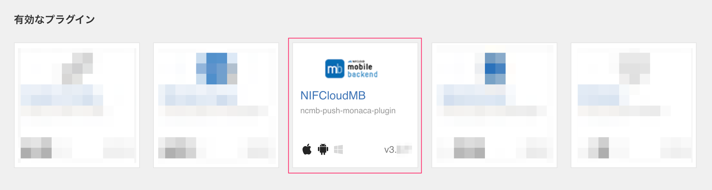]

.right_top[

]

---
.bottom-bar[
ハンズオン 3.Monacaの準備
]

### mobile backend APIキーの設定

.size_small_9[
* 引き続き mobile backend との連携のための設定を行います
* 既に開いている `index.html` タブをクリックして表示します
* `<script></script>`タグ内にコードを書いていきます
]
.center[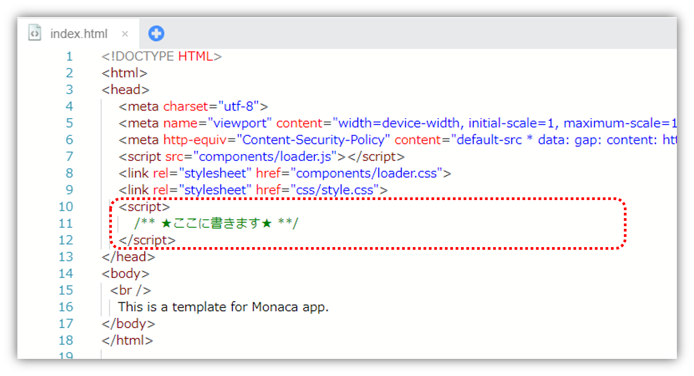]


.right_top[

]

---
.bottom-bar[
ハンズオン 3.Monacaの準備
]

### mobile backend APIキーの設定

.size_small_9[
* 次のコードを全てコピーして `<script></script>`タグ内に貼り付けてください
]

.size_small_7[
```js
document.addEventListener("deviceready", function(){
    var successCallback = function () {
        //端末登録後の処理
    };
    var errorCallback = function (err) {
        //端末登録でエラーが発生した場合の処理
    };
    // デバイストークンを取得してinstallation登録を行う
    window.NCMB.monaca.setDeviceToken(
        "YOUR_APPLICATION_KEY",
        "YOUR_CLIENT_KEY",
        successCallback,
        errorCallback
    );
},false);
```
]
.right_top[

]

---
.bottom-bar[
ハンズオン 3.Monacaの準備
]

### mobile backend APIキーの設定

.col-4[.size_small_9[
* こんな感じになればOKです
]]
.col-8[.center[]]

.right_top[

]

---
.bottom-bar[
ハンズオン 3.Monacaの準備
]

### mobile backend APIキーの設定

.col-7[.size_small_9[
* 赤枠で囲った箇所にmobile backend でアプリ新規作成時に発行された APIキー（アプリケーションキーとクライアントキー）を設定します
]]
.col-5[
.center[
]]
<br>
.size_small_5[
* APIキーは mobile backend の管理画面「アプリ設定」＞「基本」で確認できます
* アプリケーションキーとクライアントキーをコピーして、それぞれ`YOUR_NCMB_APPLICATIONKEY`と`YOUR_NCMB_CLIENTKEY`に貼り付けます
* このとき、ダブルクォーテーション「`"`」は消さないように注意しましょう
]
.center[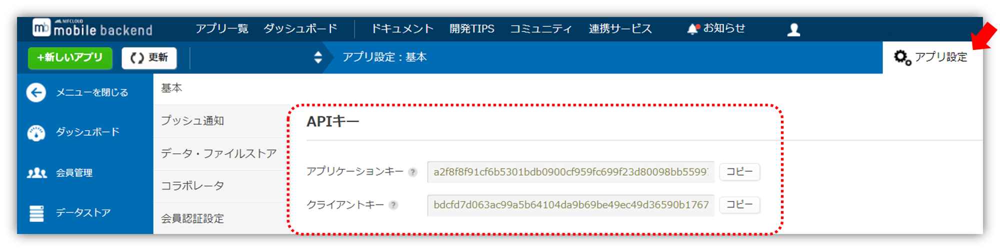]

.right_top[

]

---
.bottom-bar[
ハンズオン 3.Monacaの準備
]

### mobile backend APIキーの設定

.size_small_9[
* こんな感じになればOKです
]
.center[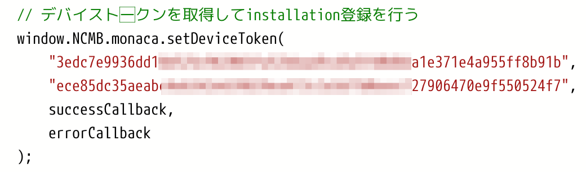]

.right_top[

]

---
.bottom-bar[
ハンズオン 3.Monacaの準備
]

### mobile backend APIキーの設定
#### 作業が完了したら保存を忘れずに！
.size_small_9[
* メニューバーの「保存」をクリックします
 * Windowsの場合は、「.color_pink[__Ctrl + S__]」でも保存できます
 * Macの場合は、「.color_pink[__Command + S__]」でも保存できます

正しく保存されていないとビルドに成功してもプッシュ通知が届きません！<br>
忘れずに実施してください。
]
.right_top[

]

---
.bottom-bar[
ハンズオン 4.ビルド
]

## 4. ビルド
### iOS で動作確認する場合

.col-4[.size_small_9[
* Monaca で「設定」＞「iOSアプリ設定...」を開きます
* アプリケーション名を変更します（任意）
* App ID を変更します
  * 準備の 4.で App ID 作成時に設定した「 Bundle ID 」に書き換えます
]]
.col-8[
.center[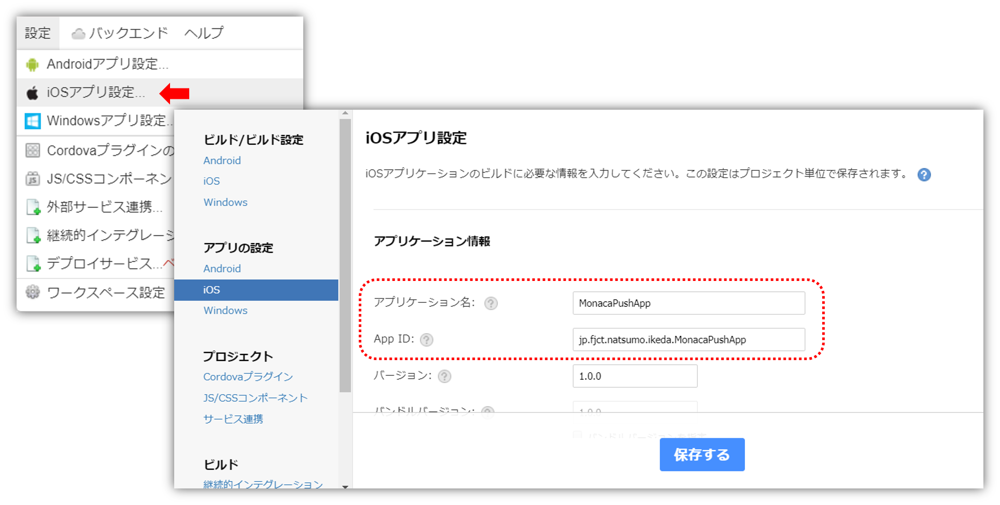]
]
.right_top[

]

---
.bottom-bar[
ハンズオン 4.ビルド
]

### iOS で動作確認する場合

.size_small_9[
* 「ビルド」＞「iOSアプリのビルド」を開き、「デバッグビルド」が選択されている状態で右下の「ビルド設定の管理」をクリックします
]

.col-3[.center[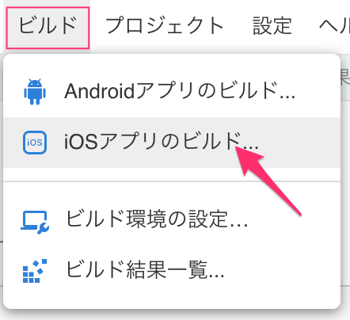]]
.col-9[.center[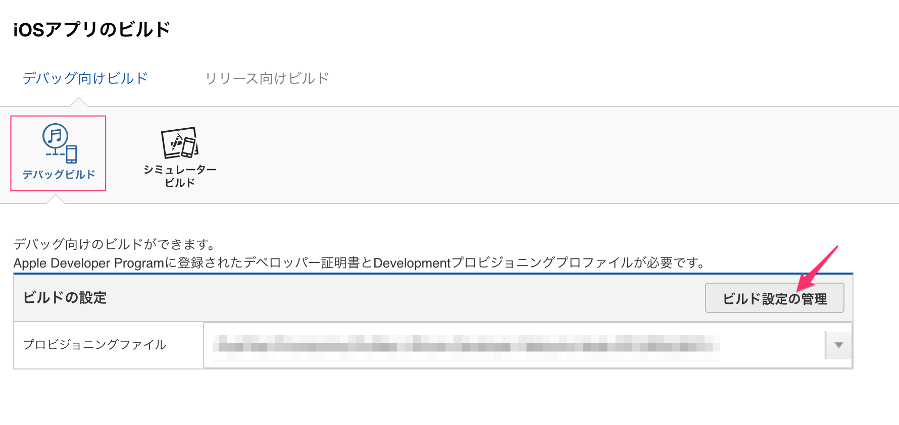]]

.right_top[

]

---
.bottom-bar[
ハンズオン 4.ビルド
]

### iOS で動作確認する場合

.size_small_9[
* 「秘密鍵と証明書のインポート」の「インポート」をクリックします
]

.center[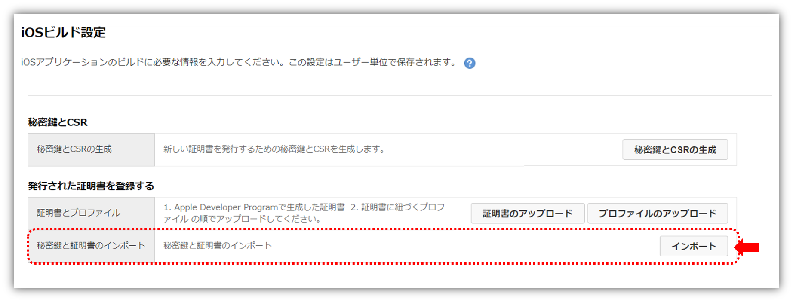]

.right_top[

]

---
.bottom-bar[
ハンズオン 4.ビルド
]

### iOS で動作確認する場合

.size_small_9[
* 準備の 3.で作成した 開発用証明書秘密鍵.p12 を設定します
* 「参照する」をクリックしてファイルを選択し、「インポート」をクリックします
  * 「キーのパスワード」は設定していないので空欄でOKです
]

.center[]

.right_top[

]

---
.bottom-bar[
ハンズオン 4.ビルド
]

### iOS で動作確認する場合

.col-4[.size_small_9[
* 「Monacaに登録された証明書」を確認すると「証明書」欄に 開発用証明書 が登録されたことが確認できます
* 確認したら、次に「プロファイルのアップロード」をクリックします
]]
.col-8[
.center[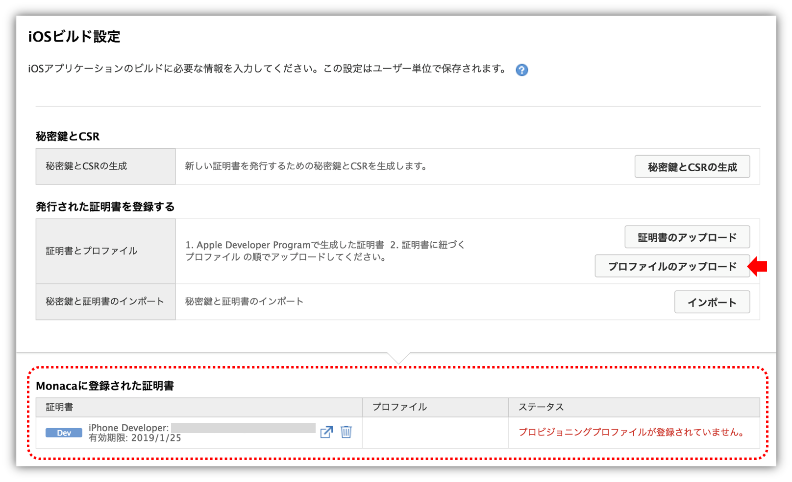]
]
.right_top[

]

---
.bottom-bar[
ハンズオン 4.ビルド
]

### iOS で動作確認する場合

.size_small_9[
* 準備の 6.で作成した プロビジョニングプロファイルを選択し設定します
* 設定できると「プロファイル」欄に プロビジョニングプロファイルが登録されたことを確認できます
]

.center[]

.size_small_9[
* 確認したら左下の「戻る」をクリックします
]

.right_top[

]

---
.bottom-bar[
ハンズオン 4.ビルド
]

### iOS で動作確認する場合

.size_small_9[
* 最後に「ビルドを開始する」をクリックします
]

.center[]

.right_top[

]

---
.bottom-bar[
ハンズオン 4.ビルド
]

### iOS で動作確認する場合

.col-4[.size_small_9[
* ブラウザの別のタブが開き、ビルドが開始されます
* 少し待つとビルドが完了します
]]
.col-8[
.center[]
]
.size_small_9[
* QRコードから端末にアプリをダウンロードしましょう
]

.right_top[

]

---
.bottom-bar[
ハンズオン 4.ビルド
]

### Android で動作確認する場合

.size_small_9[
* 「google-services.json」ファイルを設定します
* ディレクトリ表示の上にある「アップロードマーク」をクリックします
]

.center[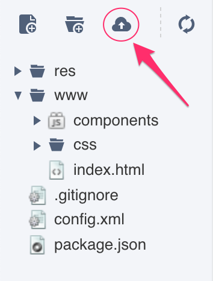]


.right_top[

]

---
.bottom-bar[
ハンズオン 4.ビルド
]

### Android で動作確認する場合

.size_small_9[
* ルートディレクトリ（`/`）であることを確認して、「ファイルの選択」またはドラック＆ドロップで先ほど作成した「google-services.json」ファイルを選択します
]

.center[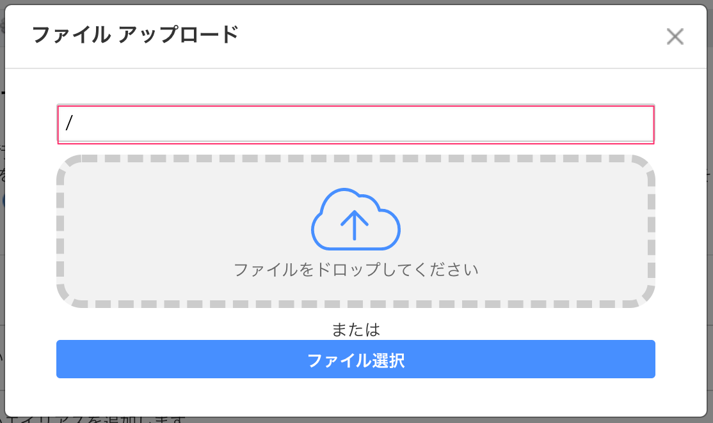]


.right_top[

]

---
.bottom-bar[
ハンズオン 4.ビルド
]

### Android で動作確認する場合

.size_small_9[
* 「google-services.json」ファイルが「config.xml」ファイルと同じ階層（ルートディレクトリ）に配置されていれば設定完了です
]

.center[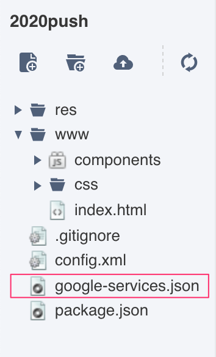]


.right_top[

]

---
.bottom-bar[
ハンズオン 4.ビルド
]

### Android で動作確認する場合

.size_small_9[
* 「ビルド」＞「Androidアプリのビルド」を開きます
* 「デバッグビルド」が選択されていることを確認して、「ビルドを開始する」をクリックします
]

.col-3[.center[]]
.col-9[.center[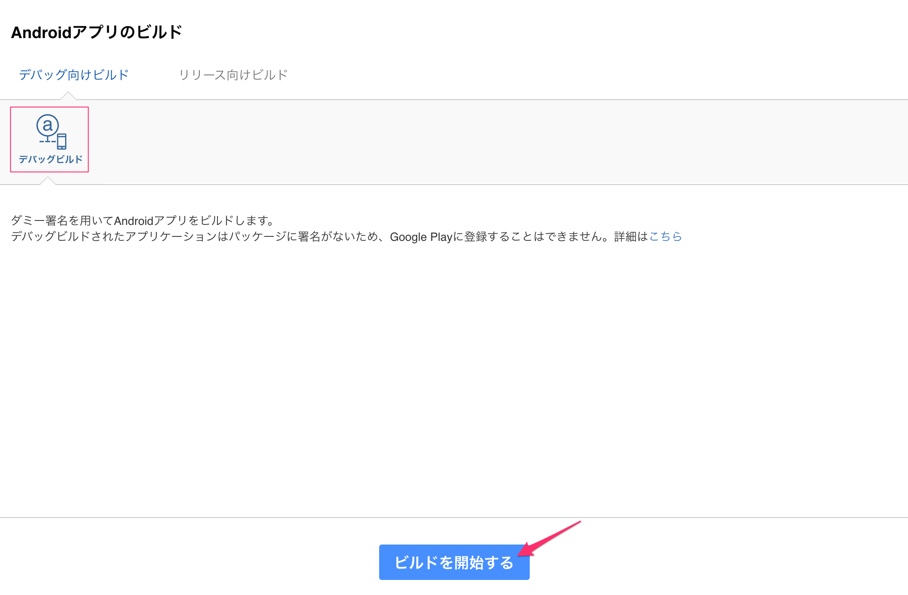]]


.right_top[

]

---
.bottom-bar[
ハンズオン 4.ビルド
]

### Android で動作確認する場合

.col-4[.size_small_9[
* ブラウザの別のタブが開き、ビルドが開始されます
* 少し待つとビルドが完了します
]]
.col-8[
.center[]
]
.size_small_9[
* QRコードから端末にアプリをダウンロードしましょう
]

.right_top[

]

---
.bottom-bar[
ハンズオン 5.動作確認と実装コード解説
]

## 5. 動作確認と実装コード解説
### iOS で動作確認する場合

.col-6[
.size_small_9[
* インストールしたアプリを起動します
* プッシュ通知の許可を求めるアラートが出たら、必ず許可してください
* 端末側で起動したアプリは一度閉じておきます
]
]

.col-6[.center[]]

.right_top[

]

---
.bottom-bar[
ハンズオン 5.動作確認と実装コード解説
]

### iOS で動作確認する場合

.size_small_9[
* 起動時「デバイストークン」が取得され、端末情報が mobile backend に保存されます
* mobile backend の管理画面から「データストア」＞「installation」クラスを開いて確認します
]

.center[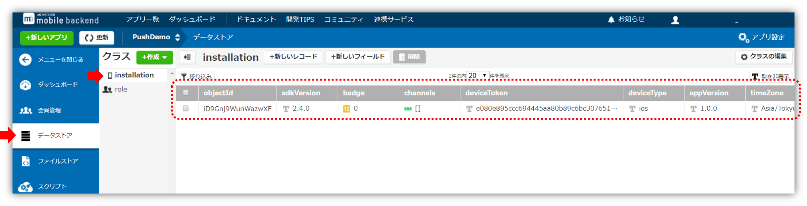]

.col-4[.size_small_7[
* 端末情報を確認できます
  * deviceToken
  * deviceType
  * timeZone など
]]
.col-8[
<br>
.center[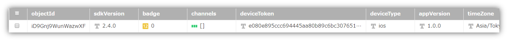]
]
.right_top[

]

---
.bottom-bar[
ハンズオン 5.動作確認と実装コード解説
]

### iOS で動作確認する場合

.size_small_9[
* プッシュ通知を送ってみましょう
* 「プッシュ通知」＞「＋新しいプッシュ通知」をクリックします
]

.center[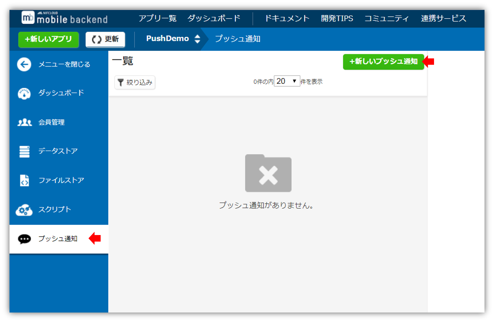]

.right_top[

]

---
.bottom-bar[
ハンズオン 5.動作確認と実装コード解説
]

### iOS で動作確認する場合

.col-4[.size_small_9[
* プッシュ通知のフォームが開かれます
* 「メッセージ」の入力、「iOS端末に配信する」へのチェックを入れます
* 「1端末に向けて送信されます」と表記されれば準備OKです
* 「プッシュ通知を作成する」をクリックしてプッシュ通知を配信します
]]
.col-8[
.center[]
]
.right_top[

]

---
.bottom-bar[
ハンズオン 5.動作確認と実装コード解説
]

### iOS で動作確認する場合

.size_small_9[
* 少し待つと端末側にプッシュ通知が届きます
* mobile backend 側で配信まで以下のようにステータスが変化します
]

.center[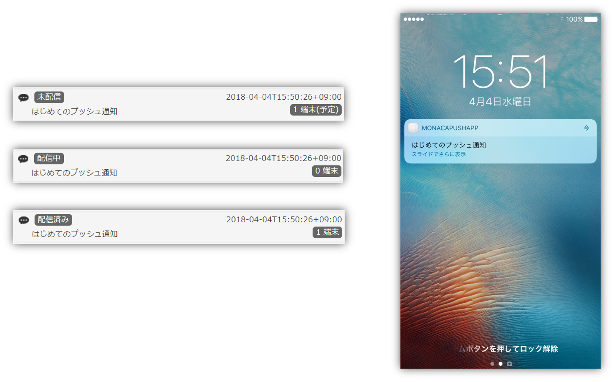]

.right_top[

]

---
.bottom-bar[
ハンズオン 5.動作確認と実装コード解説
]

### Android で動作確認する場合

.col-6[
.size_small_9[
* インストールしたアプリを起動します
* 端末側で起動したアプリは一度閉じておきます
]
]

.col-6[.center[]]

.right_top[

]

---
.bottom-bar[
ハンズオン 5.動作確認と実装コード解説
]

### Android で動作確認する場合

.size_small_9[
* 起動時「レジスタレーションID」が取得され、端末情報が mobile backend に保存されます
* mobile backend の管理画面から「データストア」＞「installation」クラスを開いて確認します
]

.center[]

.col-4[.size_small_7[
* 端末情報を確認できます
  * deviceToken
  * deviceType
  * timeZone など
]]
.col-8[
<br>
.center[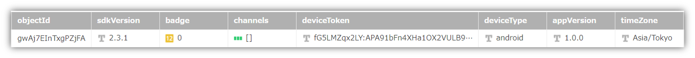]
]

.right_top[

]

---
.bottom-bar[
ハンズオン 5.動作確認と実装コード解説
]

### Android で動作確認する場合

.size_small_9[
* プッシュ通知を送ってみましょう
* 「プッシュ通知」＞「＋新しいプッシュ通知」をクリックします
]

.center[]
.right_top[

]

---
.bottom-bar[
ハンズオン 5.動作確認と実装コード解説
]

### Android で動作確認する場合

.col-4[.size_small_9[
* プッシュ通知のフォームが開かれます
* 「メッセージ」の入力、「Android端末に配信する」へのチェックを入れます
* 「1端末に向けて送信されます」と表記されれば準備OKです
* 「プッシュ通知を作成する」をクリックしてプッシュ通知を配信します
]]
.col-8[
.center[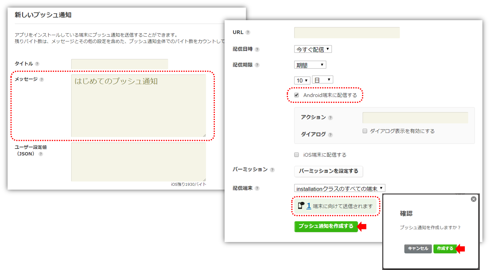]
]
.right_top[

]

---
.bottom-bar[
ハンズオン 5.動作確認と実装コード解説
]

### Android で動作確認する場合

.size_small_9[
* 少し待つと端末側にプッシュ通知が届きます
* mobile backend 側で配信まで以下のようにステータスが変化します
]

.center[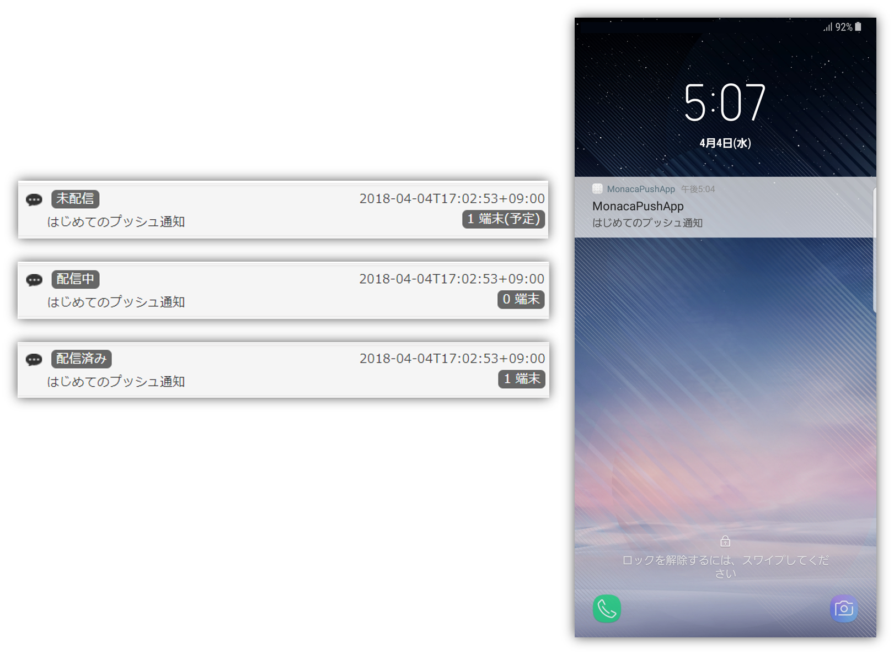]

.right_top[

]

---

layout: true
class: center, middle, animation-fade

---

# まとめ

---
layout: false

.bottom-bar[
まとめ
]

## プッシュ通知を体験しました！

* プッシュ通知の仕組みを学びました
   * アプリ起動時の処理
   * プッシュ通知配信時の処理
* プッシュ通知の実装方法を学びました
   * プッシュ通知に必要な準備
      * iOSの場合は準備が少し面倒…
   * Monaca で mobile backend の実装は非常に簡単！！
      * プラグインの導入
      * 数行のコード

---

layout: true
class: center, middle, animation-fade

---

# おわりに

---
layout: false

.bottom-bar[
おわりに
]

## サンプル＆チュートリアルのご紹介
いかがでしたでしょうか？こんなに使いやすくて便利な mobile backend をもっと活用してみたい方へ、mobile backend の各機能をすぐに試すことができるサンプルアプリを多数ご用意しています。Monaca にサンプルプロジェクトをインポートして、簡単な操作をするだけですぐにお試しいただけます！ぜひご活用ください。

* サンプル＆チュートリアル一覧 \| ニフクラ mobile backend
  * .size_small_7[`https://mbaas.nifcloud.com/doc/current/tutorial/tutorial_javascript.html`]


---

layout: true
class: center, middle, animation-fade

---

# ご清聴ありがとうございました！
